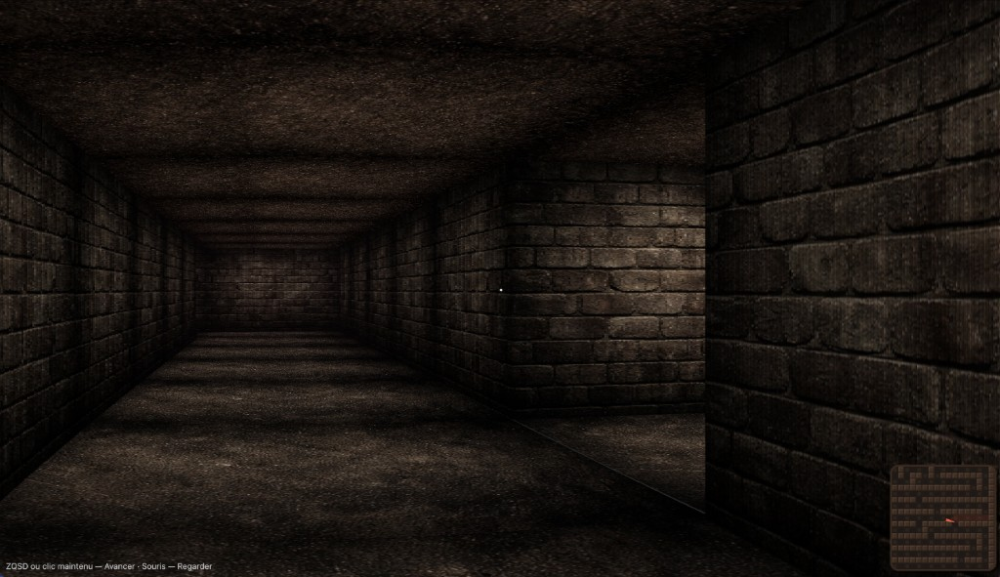

# Scary Maze 2

A short first-person maze game with a tense atmosphere. Navigate the corridors, avoid the rats, and survive. Built with **raycasting** (Wolfenstein 3D–style) in **TypeScript** and **Vite**.



## Run the game

```bash
npm install
npm run dev
```

Open the URL shown in the terminal (usually `http://localhost:5173`). **Click on the game canvas** to lock the mouse pointer, then move and look around.

## How to play

- **W / Z** — Move forward  
- **S** — Move backward  
- **A / Q** — Strafe left  
- **D** — Strafe right  
- **Mouse** — Look around (after clicking to capture the pointer)  
- **Left / Right arrows** — Turn (alternative to mouse)  
- **Hold left click** — Move forward (when pointer is locked)

Rats spawn over time and run along the walls. A **minimap** in the bottom-right shows your position and field of view. A **cutscene** can trigger after a set time.

## Build for production

```bash
npm run build
npm run preview
```

Output is in `dist/`. Use `preview` to test the production build locally.

## Tech stack

- **TypeScript** (ES modules)
- **Vite** (dev server and build)
- **Canvas 2D** (no WebGL)
- **DDA** raycasting for 3D walls, textured floor/ceiling, sprites (rats), and minimap

## Project structure

| Path | Role |
|------|------|
| `src/main.ts` | Game loop, input (keyboard/mouse) |
| `src/game/player.ts` | Position, angle, movement |
| `src/game/map.ts` | 2D grid (walls, spawn) |
| `src/game/raycaster.ts` | Ray casting (DDA) |
| `src/game/renderer.ts` | Drawing: walls, floor, ceiling, sprites |
| `src/game/minimap.ts` | Styled minimap with FOV cone |
| `src/game/rats.ts` | Rat spawn and movement |

